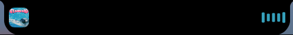
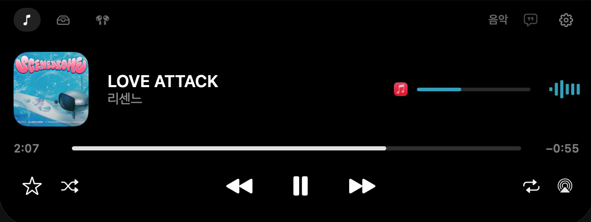
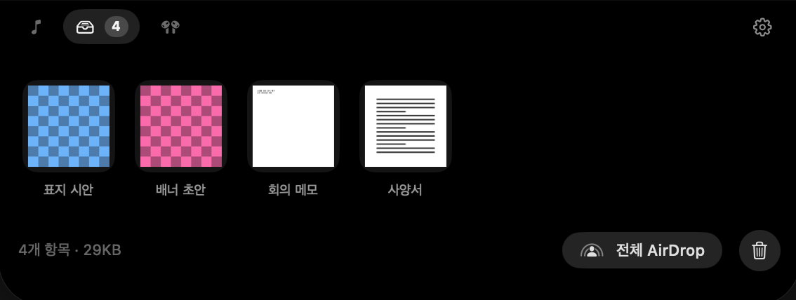
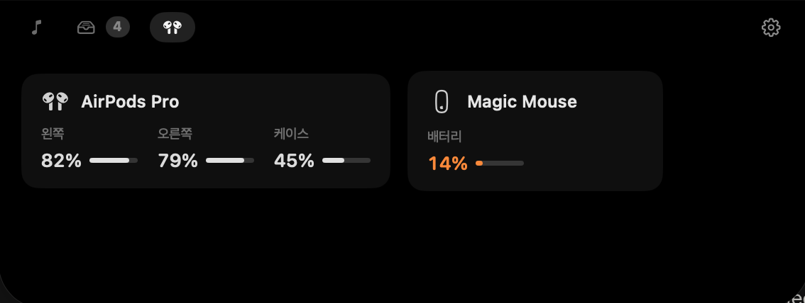

# Peninsula

*[English](README.md)*

맥북 노치를 다이나믹 아일랜드로 만드는 macOS 앱. SwiftUI + AppKit, 외부 의존성 없음.

**상주 CPU 0.05% · 메모리 14MB · 스레드 3개.**









> **재생 정보는 비공개 API에서 옵니다.** macOS는 다른 앱의 재생 정보를 공개 API로 주지 않아서, 시스템 perl을 통해 MediaRemote를 읽습니다 ([자세히](#알아둘-것)). Apple이 언제든 이 경로를 막을 수 있고, 그때는 노치에 표시됩니다. 같은 이유로 App Store에는 올릴 수 없습니다.
>
> 선반, AirDrop, 기기 배터리, HUD, 라이브 알림은 전부 공개 API입니다.

---

## 설치

macOS 14 이상 · 노치가 있는 맥북.

[릴리스](https://github.com/Team-Lunibee/Peninsula/releases)에서 zip을 받아 풀고 **응용 프로그램** 폴더로 옮기세요.

자동 실행은 응용 프로그램 폴더로 옮긴 **뒤에** 켜세요. 경로로 등록됩니다.

**언어** — 한국어 · English · 日本語 · 简体中文 · Español · Français · Deutsch. 시스템 언어를 따라갑니다.

### 소스에서 빌드

```bash
./scripts/bundle.sh release && open build/Peninsula.app
```

첫 빌드에서 [mediaremote-adapter](https://github.com/ungive/mediaremote-adapter)(BSD-3)를 받아 프레임워크로 빌드합니다. cmake는 필요 없습니다.

---

## 기능

**재생 중** — 앨범아트(곡이 바뀌면 3D 플립), 제목, 아티스트, lrclib.net 동기화 가사, 스크러버, 별·이전·재생·다음·AirPlay, 시스템 볼륨, 미터. 가사는 쉬는 상태의 알약에도 표시됩니다.

**선반** — 화면 위쪽 넓은 띠가 드래그를 잡고 패널이 열립니다. **AirDrop : 선반 = 1:3**으로 나뉘어 놓는 위치가 곧 목적지입니다. 파일은 앱 전용 폴더로 복사되므로 원본을 옮겨도 유지됩니다. 더블클릭하면 Quick Look. 보관 기간은 1일부터 무기한까지 설정할 수 있습니다.

**기기** — 블루투스 기기 배터리. 에어팟은 좌·우·케이스를 따로 봅니다.

**라이브 알림** — 충전·배터리, 다운로드, 스크린샷, 기기 연결, AirDrop 수신.

**HUD 대체** — 볼륨·밝기 키를 시스템 오버레이 대신 노치에 표시합니다. 손쉬운 사용 권한이 필요하고, 권한을 준 순간 스스로 켜집니다.

---

## 성능

| | |
|---|---|
| 유휴 CPU | **0.05%** |
| 메모리 · 재생 없음 | **14MB** |
| 메모리 · 재생 중 | **23~30MB** |
| 스레드 · 유휴 | **3** |
| 확대/축소 200회당 증가분 | **0MB** |

유휴 CPU는 **31.8시간 연속 사용**(재생·패널·선반 포함) 동안 쌓인 누적 CPU 54.2초를 나눈 값입니다. 조용한 순간만 골라 잰 게 아닙니다. 메모리는 앨범아트가 올라와 있느냐가 거의 전부이고, 같은 빌드에서 100초 측정을 반복하면 23~30MB 사이로 흔들리므로 단일 측정값은 ±4MB로 보시면 됩니다.

미터는 Core Animation이 그립니다. 프레임 보간은 렌더 서버가 맡고 앱은 초당 4회 목표값만 정하며, 화면이 꺼지면 포인터 추적과 함께 완전히 멈춥니다. 앨범아트는 `CGImageSourceCreateThumbnailAtIndex`로 디코드해서 3000×3000 커버가 36MB 픽셀이 되는 일이 없습니다. 텍스트는 프레임마다가 아니라 전환당 한 번만 래스터화되고, 200회 반복에도 증가분이 0인 이유가 그것입니다.

---

## 왜 반도(peninsula)인가

아이폰은 **섬**입니다. 화면 한가운데 떠 있는 픽셀이라 마음대로 키울 수 있습니다. 맥북 노치는 패널에 뚫린 구멍이고 베젤에서 떼어낼 수 없습니다. 그래서 섬을 흉내 내지 않고, 붙어 있는 채로 뻗어 나갑니다 — 컷아웃과 똑같은 검정을 컷아웃 경계에서 시작해 자라나게 그립니다.

여기서 규칙 둘이 따라 나오고, 코드 전체가 그 위에 서 있습니다.

**쉬는 상태는 컷아웃과 같다.** 상태는 넷입니다 — `idle`(안 보임), `compact`, `peek`(배너), `expanded`. 알약을 항상 컷아웃보다 넓게 두면 노치가 아니라 검은 막대가 됩니다.

**컷아웃 위에는 아무것도 그리지 않는다.** 카메라 하우징 뒤는 화면이 아니라서, 그 위도를 지나는 모든 행이 leading / gap / trailing으로 쪼개집니다. 탭이 셋이 되어 라벨이 안 들어가면 아이콘만 남깁니다.

노치는 비공개 윈도우 서버 Space에 고정되어, 데스크탑을 넘겨도 따라가지 않고 전체 화면 앱 위에도 남습니다.

---

## 모션

Apple이 WWDC23에서 정한 표기(`duration` + `bounce`)를 씁니다. [`Motion.Timeline`](Sources/Peninsula/Motion/Motion.swift) 한 곳에 정의되고 실제 애니메이션과 모션 실험실이 같은 값을 읽습니다.

기본값은 고른 게 아니라 맞춘 값입니다 — 실제 다이나믹 아일랜드를 50fps로 녹화해 프레임마다 실루엣을 뽑고 `Spring(duration:bounce:)`에 최소자승으로 적합시켰습니다.

| | duration | bounce | 적합도(rms) |
|---|---|---|---|
| 확장 · 가로 | 0.445s | +0.10 | 0.009 |
| 확장 · 세로 | 0.420s | +0.06 | 0.011 |
| 축소 · 세로 | 0.455s | +0.12 | 0.007 |
| 축소 · 가로 | ~0.19s | 과감쇠 | — |

확장할 때 두 축은 2% 안쪽으로 붙어 함께 움직입니다. 축소할 때는 폭이 2배 먼저 도착해서, 패널이 가로로 오므라들어 세로로 긴 검정 블록이 되고 그게 위로 빨려 들어갑니다.

내용은 재배치되지 않고 통째로 스케일됩니다. 각 상태를 자기 최종 크기로 한 번 배치하고 컨테이너의 스프링으로 스케일하는데, 레퍼런스가 그렇게 동작합니다. 흐림은 별도 시계를 타서 들어올 때는 75% 지점에 이미 선명하고 나갈 때는 두 프레임 만에 읽을 수 없어집니다. 반동은 가로 전용 임펄스이고 폭이 도착하는 순간 들어갑니다.

### 모션 실험실

설정 › 모션 실험실에서 실제 아일랜드 내용을 1/60초 단위로 넘겨볼 수 있습니다. 개발 빌드에만 들어갑니다.

```bash
"$(swift build --show-bin-path)/Peninsula" --dump-frames ./frames
```

---

## 보안

**entitlement는 두 개뿐입니다** — 샌드박스 해제(perl 실행과 파일 복사), Apple 이벤트(음악 즐겨찾기).

**밖으로 나가는 데이터는 네 개**입니다. 곡명·아티스트·앨범·재생시간이 lrclib.net으로 HTTPS·ephemeral 세션으로 나가고, 설정에서 끌 수 있습니다.

**이벤트 탭은 키 입력을 볼 수 없습니다.** `NX_SYSDEFINED`만 구독하므로 키보드·마우스 이벤트는 애초에 전달되지 않습니다.

**파일명과 경로는 `.private`으로 기록됩니다.** 시스템 로그와 sysdiagnose에 남지 않습니다.

**비공개 API는 전부 `dlsym`으로 부릅니다.** 심볼이 사라지면 `nil`이 되어 해당 기능만 꺼지고, 직접 바인딩이었다면 앱이 실행조차 안 됩니다.

---

## 알아둘 것

**재생 정보** — macOS 15.4부터 MediaRemote는 Apple 자체 프로세스만 접근할 수 있습니다. Peninsula는 아직 권한이 남아 있는 시스템 perl 바이너리를 통해 [mediaremote-adapter](https://github.com/ungive/mediaremote-adapter)로 읽습니다.

**AirDrop 수신은 `sharingd`가 처리합니다.** 승인 대화상자도 진행률도 그쪽 소유입니다. 대신 도착을 감지하는데, 받은 파일에는 `com.apple.quarantine`에 `sharingd`가 에이전트로 찍혀 있어 같은 폴더의 일반 다운로드와 구분됩니다.

**미터는 장식입니다.** 다른 앱의 오디오 출력을 읽는 공개 API는 없습니다.

**서명** — macOS는 개인정보 권한을 코드 서명에 묶기 때문에 애드혹 서명은 빌드마다 권한이 사라집니다. 번들러가 Developer ID 인증서를 우선 찾고, `SIGN_IDENTITY=...`로 지정할 수도 있습니다.

---

## 구조

```
Sources/Peninsula/
  App/      진입점, 앱 델리게이트, 상태 표시줄
  Core/     환경설정, 로그인 항목, 관찰 루프, 로그, 업데이트
  Motion/   스프링 타임라인, 전환, 프레임 덤프
  Notch/    패널·형태·기하·컨트롤러
  Media/    MediaRemote 브리지, 재생, 가사, 아트워크, 볼륨
  Shelf/    선반 저장소, 드래그 감지, Quick Look
  System/   전원·폴더·블루투스 관찰, HUD 탭, 밝기
  UI/       SwiftUI 뷰
```

핵심 셋: [`NotchController`](Sources/Peninsula/Notch/NotchController.swift), [`NotchViewModel`](Sources/Peninsula/Notch/NotchViewModel.swift), [`Motion`](Sources/Peninsula/Motion/Motion.swift).

---

## 배포

```bash
./scripts/release.sh
```

빌드 → 서명 → 공증 → 스테이플까지 하고 `build/dist/Peninsula-<버전>.zip`을 내놓습니다.

**Developer ID Application 인증서가 필요합니다.** Apple Distribution이나 Apple Development로는 공증이 안 됩니다. 자격증명은 한 번만 저장하면 됩니다:

```bash
xcrun notarytool store-credentials Peninsula-notary --apple-id you@example.com --team-id TEAMID --password xxxx-xxxx-xxxx-xxxx
```

아이콘은 디자인 도구에서 내보낸 파일이 아니라 `scripts/make-icon.swift`가 그립니다.

---

## 라이선스

[MIT](LICENSE). [mediaremote-adapter](https://github.com/ungive/mediaremote-adapter)(BSD 3-Clause, © 2025 Jonas van den Berg)를 포함합니다.
